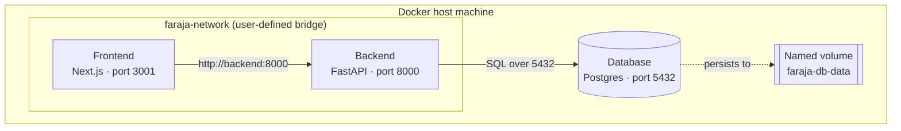

# Faraja — Container Architecture

Container-level architecture of the Faraja project, based on the service Dockerfiles in this repo. This covers containers only — no Docker Compose or Kubernetes orchestration.

## Overview

| Service  | Base image                     | Port | Purpose                                       |
|----------|----------------------------------|:----:|------------------------------------------------|
| Frontend | `node:18-alpine` (multi-stage)   | 3001 | Next.js app, served via `npm start`            |
| Backend  | `python:3.12.13-slim`           | 8000 | FastAPI app served via `uvicorn`               |
| Database | `postgres:16-alpine`            | 5432 | PostgreSQL database (`faraja`)                 |



## Service details

### Frontend
- Multi-stage build on `node:18-alpine`.
- **Builder stage:** installs dependencies with `npm install`, copies source, runs `npm run build`.
- **Runner stage:** copies the built `.next` output, `public/` assets, and `package*.json` from the builder, then installs production-only dependencies with `npm install --only=production`.
- Runs as a non-root user (`nextjs`, uid 1001, group `nodejs`).
- Environment: `NODE_ENV=production`, `NEXT_TELEMETRY_DISABLED=1`.
- Listens on port 3001.
- `HEALTHCHECK` polls `http://localhost:3001` every 30s via `wget`.
- Starts with `CMD ["npm", "start"]`.
- Configured via `NEXT_PUBLIC_API_URL`, pointing at the backend's address.

### Backend
- Base image: `python:3.12.13-slim`.
- Working directory: `/backend`.
- Installs dependencies via `pip install -r requirements.txt`.
- Listens on port 8000.
- Starts with `uvicorn app.main:app --port 8000 --host 0.0.0.0`.
- Creates the database schema on startup via SQLModel's `create_all()`.

### Database
- Base image: `postgres:16-alpine`.
- Environment: `POSTGRES_DB=faraja`, `POSTGRES_USER=postgres`, `POSTGRES_PASSWORD=postgres`.
- Listens on port 5432.
- Data persists via a named volume mounted at `/var/lib/postgresql/data`.
- Ships with no schema; tables are created by the backend on first connection.

## Running the containers

1. Create a shared network so containers can resolve each other by name:
```
   docker network create faraja-network
```
2. Run the database on `faraja-network`, with its data volume attached.
3. Run the backend on `faraja-network`, pointed at the database's container name on port 5432.
4. Run the frontend on `faraja-network`, publishing port 3001 to the host, with:
```
   -e NEXT_PUBLIC_API_URL=http://backend:8000
```

## Startup order

1. **Database** — must be up and accepting connections first.
2. **Backend** — connects to the database and creates the schema.
3. **Frontend** — depends on the backend's API being reachable.
